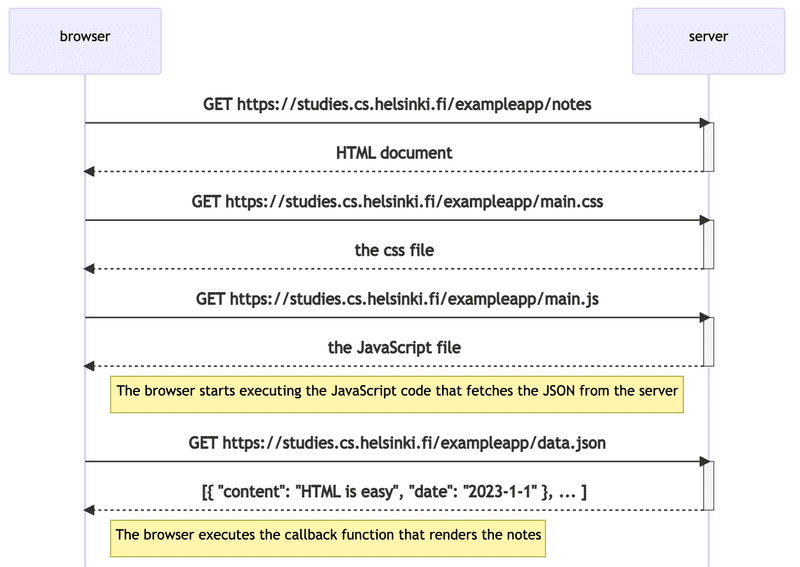

# Part 0b - Fundamentals of web apps
- Shortcut for opening the Developer Console on Mac (`option-cmd-i`) and on Windows (`fn-F12`)
## HTTP GET
- Reading and understanding the `Network` tab in the Developer Console

## Traditional web applications
- Browser is dumb (only fetches HTML data from server), server handles all application logic.

## Running application logic in the browser
- Continuation of understanding the `Network` tab and now also the `Console` tab.
- How the browser executes the code.

## Event handlers and Callback functions
- Event handler functions are called callback functions.
- Application code does not invoke, runtime environment (browser) does when the event has occurred.

## Document Object Model or DOM
- HTML elements as a tree.
- DOM is an API that enables programmatic modification of the element tree.

## Manipulating the document object from the console
- Topmost node of the DOM tree is the `document` object.
- Changes are not permanent - when page reloaded, changes will disappear (these are not pushed to the server).

## Cascading Style Sheets (CSS)
- Style sheet language for determining appearance of web pages.
- Class selectors - used to select certain parts of the page and to define styling rules.
    - Always starts with a period and contains the class name e.g.:
    ```css
    .container {
        padding: 10px;
        border: 1px solid;
    }
    ```
- Classes - attributes that can be added to HTML elements.
    - e.g.:
    ```html
    <div class="container">
    ```
    - Can be examined in `Elements` tab in the console.
- HTML elements can have other attributes (other than classes).
    - e.g.: `id` attribute.

## Loading a page containing Javascript - review


## Forms and HTTP POST
- (*) Browser sends HTTP POST to server -> Server responds with 302 (URL redirect) -> Browser sends GET to address in header's `Location`.

## Asynchronous JavaScripta and XML (AJAX)
- Approach that enabled content fetching to web pages using Javascript within HTML without need for page rerendering.
- Commonplace, taken for granted.

## Single page app
- Only one HTML page fetched from server, whose contents are manipulated with JavaScript that executes in the browser.
- Unlike the above (*): Browser sends request to server -> Server responds with 201 (created) -> Browser stays on same page with no further HTTP requests (it uses the JavaScript code fetched from server).
> [!NOTE]
> `e.preventDefault()` used to prevent default handling of form's submit.

## JavaScript-libraries
- `jQuery` - cross-browser compatible
- `BackboneJS` -> `Angular` -> `React`, `Redux`
- `VueJS`

## Full-stack web development
- Ill-defined definition of what this is.
- Frontend, backend, datatabase.
