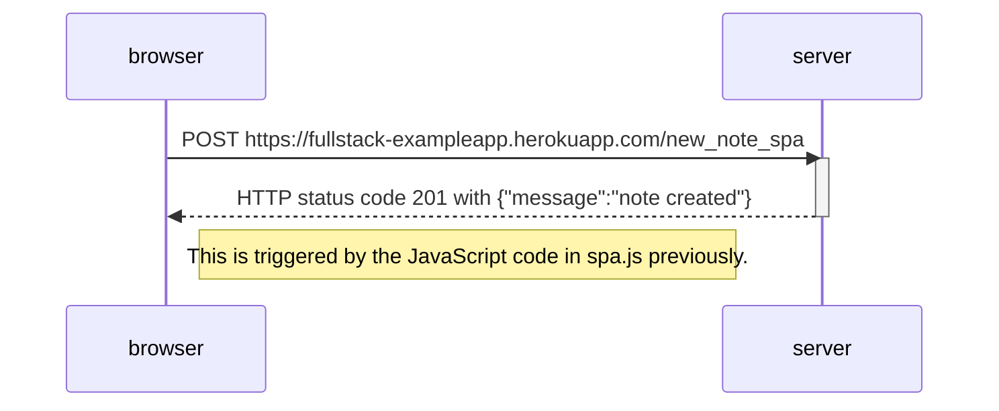

```mermaid
sequenceDiagram
    participant browser
    participant server

    browser->>server: POST https://fullstack-exampleapp.herokuapp.com/new_note_spa
    activate server
    server-->>browser: HTTP status code 201 with {"message":"note created"}
    deactivate server
    Note right of browser: This is triggered by the JavaScript code in spa.js previously.
```
